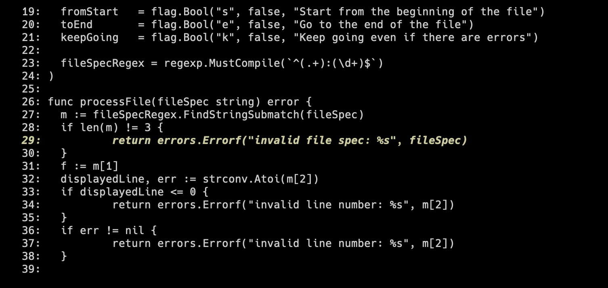

# showline

Like `cat` but consumes strings like `<file>:<line>` and highlights the target line.

## Install

```sh
go install github.com/spudtrooper/showline@latest
```

## Usage

```sh
showline main.go:29
```


